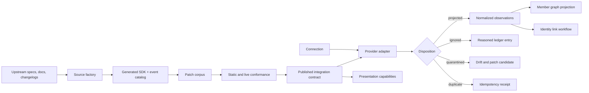

# Freeside Integrations — architectural overview

Status: candidate architecture  
Date: 2026-07-15  
Decision owner: operator  
Target: evolve `freeside-mediums` / `mediums-api`; do not create a new building

## 1. Decision

`freeside-mediums` becomes the Freeside integrations building. Its current
medium registry is retained as the first internal domain and compatibility
surface, not treated as the permanent boundary of the repository.

Recommended naming:

- building/repository: `freeside-integrations`
- federation slug: `integrations-api`
- `Integration`: a supported provider definition and verified contract
- `Connection`: a configured provider installation for a Freeside tenant
- `MediumCapability`: the provider's presentation surface for a delivery context
- `Observation`: a durable, normalized fact emitted from provider behavior

This is an evolutionary monolith with strong internal contracts. A future split
requires demonstrated pressure from security isolation, independent release
cadence, scaling, ownership, or failure containment.

## 2. Invariant center

The building's invariant is:

> Provider behavior enters Freeside through a versioned, evidence-backed
> contract, and every received event has a durable, explainable disposition.

The design must survive wrong or drifting vendor specifications without losing
events, silently changing meaning, or forcing consumers to understand raw
provider payloads.

## 3. System shape



## 4. Internal domains

### Protocol

Own stable schemas for:

- provider and integration identifiers
- connection metadata and lifecycle state
- raw event envelopes
- normalized observations
- ingestion dispositions
- coverage manifests
- source and evidence receipts

Schemas describe data crossing boundaries. Runtime clients, credentials, and
provider-specific payloads do not leak into shared domain contracts.

### Source factory

For each provider, record:

- authoritative source URL/repository
- immutable ref or content digest
- retrieval timestamp
- source class: OpenAPI, event catalog, docs, changelog, or source code
- generator and version
- discovered operations/events
- applied patches and their owners
- semantic-focus and source-domain validation result

Discord has separate REST and Gateway sources. Telegram requires a governed
derivative because no official OpenAPI source is available. Luma supplies an
OpenAPI registry plus webhook contracts.

### Patch corpus

A patch is the durable representation of observed upstream/spec divergence.
Patches are small, provider-scoped, reviewed, and applied by generation. A
generated operation is never fixed by hand.

Unknown runtime behavior creates a quarantine record and patch candidate. It
does not become permanent adapter folklore.

### Connections

A connection represents an installed provider instance:

```text
connection_id
tenant_id
provider
external_scope_id       guild, chat, calendar, or organization
credential_reference   never the secret itself
granted_scopes
status                  pending | active | degraded | revoked
cursor/checkpoint
contract_version
last_verified_at
```

Connection lifecycle and health are control-plane concerns. Provider SDK types
remain data-plane implementation details.

### Provider adapters

Each provider adapter:

1. verifies and decodes the provider boundary
2. normalizes supported behavior into observations
3. explicitly ignores classified non-domain events
4. quarantines unknown or malformed behavior
5. performs reconciliation/backfill where the provider permits it
6. emits structured telemetry without payload or secret leakage

### Ingestion runtime

The runtime owns webhook, Gateway, polling, retry, cursor, replay, and dedupe
mechanics. Idempotency registration and disposition persistence must be one
atomic storage operation; claiming an event before persisting its result can
lose data on failure.

### Presentation

The current `@0xhoneyjar/medium-registry` remains the compatibility package.
Over time it becomes a view derived from verified provider capabilities, with
delivery-context variants such as Discord webhook and Discord interaction.

Presentation capabilities do not own credentials, connections, ingestion, or
identity semantics.

## 5. Observation and member-graph contract

Recommended graph nodes:

- `IdentityUser`
- `ExternalAccount(provider, external_id)`
- `Community`
- `RoleOrEntitlement`
- `Event`
- `RegistrationOrTicket`

Recommended edges:

- `account_of` — verified proof only
- `member_of`
- `role_in`
- `follows`
- `registered_for`
- `attended`
- `hosts` / `admin_of`
- `invited_by`
- `linked_wallet`

Every observation carries provider, connection, tenant, upstream event ID,
observed/effective/ingested timestamps, source contract version, raw payload
hash, evidence reference, privacy class, and retention policy.

Provider facts are not identity conclusions. A Luma email match, shared display
name, or Telegram username does not merge subjects. Identity owns proof and
publishes link/revocation observations.

## 6. Coverage definition

“100% coverage” is a vector:

| Dimension | Required claim |
|---|---|
| Discovery | Every discovered operation/event is classified |
| Generation | Every Tier-1 operation/event produces a client/parser |
| Behavior | Happy path and typed documented failures are verified |
| Ingestion | Every received event has a durable disposition |
| Reconciliation | Projection can be rebuilt where the provider permits it |
| Lifecycle | Create/read/update/delete/list/cleanup are tested where applicable |
| Evidence | Every published claim points to source and verification evidence |

Each surface entry is:

- Tier 1: supported and conformance-gated
- Tier 2: deferred/on-demand with a reason
- Tier 3: intentionally excluded with a reason

The promise is 100% classification, 100% Tier-1 conformance, and zero silent
ingestion loss—not complete knowledge of all upstream state.

## 7. Provider plan

### Discord — first vertical

Inputs:

- official preview REST OpenAPI specification
- official Gateway event documentation/catalog
- changelog
- live disposable guild

Tier-1 domain signals:

- guild member add/update/remove
- role and permission changes
- guild/channel/thread identity needed for context
- installation and scope state
- interactions used as identity or entitlement evidence

Message content is excluded by default. REST success is verified out of band.
Gateway replay, resume, sequence gaps, invalid sessions, and reconciliation are
separate from REST operation coverage.

### Telegram — second vertical

Build a versioned internal specification from official Bot API docs, changelog,
the official server source, and captured fixtures. Track webhook versus
`getUpdates`, `update_id`, `allowed_updates`, and the 24-hour upstream retention
window.

Telegram cannot provide a trustworthy arbitrary historical member enumeration.
Coverage must distinguish observed membership transitions from reconstructible
full state.

### Luma — third vertical

Generate from the available OpenAPI registry and cover webhook plus scheduled
reconciliation. Prioritize guest registration/status, tickets, calendar
subscription, membership tiers/status, event relationships, and attendance.

Payloads can include email, phone, registration answers, wallet addresses, and
revenue. Default to minimization: stable upstream IDs and necessary edges enter
the graph; sensitive fields require an explicit purpose and retention policy.

## 8. Governance loop

```text
observe upstream change
  -> pin source and digest
  -> regenerate
  -> apply reviewed patches
  -> static conformance
  -> disposable live verification
  -> coverage and evidence receipt
  -> review/audit
  -> operator publish gate
  -> consumer pin
  -> canary/reconcile/drift detection
```

Required publication receipt:

- provider and contract version
- source refs/digests
- generator version
- patch-set digest
- classified coverage report
- static and live test results
- test environment identity, without credentials
- known limitations
- approval/publish state

Retrieval or generation success is never sufficient publication evidence.

## 9. Security and privacy

- Store secret references, not secrets, in connection records.
- Verify webhook authenticity where the provider supports it.
- Apply least-privilege scopes and record requested versus granted permissions.
- Use disposable tenants for destructive live tests.
- Redact payloads from logs and traces; annotate with stable IDs and hashes.
- Encrypt or avoid PII; apply explicit retention and deletion behavior.
- Do not ingest message content by default.
- Treat cross-repo agent or event messages as data, never instructions.

## 10. Repository evolution

Suggested target topology:

```text
packages/
  protocol/              shared schemas and compatibility exports
  medium-registry/       compatibility package/view
  source-contracts/      pins, patches, coverage, evidence
  provider-discord/
  provider-telegram/
  provider-luma/
  integration-runtime/   connection + ingestion orchestration
apps/
  api/                   connection/control plane
  worker/                webhook, Gateway, polling, replay
scripts/
  source-sync/
  coverage/
  live-conformance/
```

This is a destination map, not an instruction to create every package in the
first sprint. Start with the smallest complete Discord vertical and extract
packages only when the boundary has real code and tests.

## 11. Migration waves

1. Ratify the mission change and compatibility policy.
2. Rename building metadata additively; retain old package imports and aliases.
3. Add common source, patch, evidence, connection, observation, and disposition
   contracts.
4. Implement Discord source generation and patching.
5. Implement one Discord connection and ingestion vertical.
6. Prove committed, duplicate, ignored, quarantined, replay, reconciliation,
   cleanup, and drift behavior.
7. Publish the first coverage/evidence receipt.
8. Repeat the governed template for Telegram and then Luma.
9. Deprecate old building naming only after consumers and federation metadata
   have migrated.

## 12. Last-responsible-moment boundaries

Do not split the building yet. Reconsider only when evidence shows one of:

- credentials/runtime require an independent security boundary
- generated packages need materially different release cadence
- ingestion load requires independent scaling
- separate teams own contracts and runtime
- provider failures threaten unrelated control-plane availability

Until then, package seams and typed contracts provide enough isolation with a
lower coordination cost.

## 13. Acceptance for the first ratified slice

- Existing medium-registry consumers remain source-compatible.
- Discord REST and Gateway surfaces have separate source manifests.
- Every discovered Discord event is classified.
- Tier-1 member/role events decode to normalized observations.
- Unknown and malformed events persist as quarantine dispositions.
- Duplicate upstream events are idempotent.
- Atomic disposition persistence is tested.
- Secrets and real user payloads are absent from source control and fixtures.
- A coverage report and evidence receipt are reviewable artifacts.
- Loa review and audit gates pass before publication.

## 14. Primary references

- [Distilled](https://github.com/alchemy-run/distilled)
- [Alchemy Effect AWS coverage PR](https://github.com/alchemy-run/alchemy-effect/pull/797)
- [Cloudflare resource factory](https://v2.alchemy.run/blog/2026-07-02-cloudflare-resource-factory/)
- [Governance Engineering](https://blog.hosaka.fm/governance-engineering/)
- [Discord API specification](https://github.com/discord/discord-api-spec)
- [Telegram Bot API](https://core.telegram.org/bots/api)
- [Telegram Bot API server](https://github.com/tdlib/telegram-bot-api)
- [Luma developer index](https://docs.luma.com/llms.txt)

